# TODO LIST APP 📝- ADA ITW

*Deploy link hosted on VERCEL* >> https://todo-list-app-catasha27.vercel.app/

This TODO LIST app allows you to add tasks, mark them as complete when they are done and delete them when needed.

## 👥 Developed as a group by:
* ♥ **Sharime Cahuas** (https://github.com/catasha27)
* ♥ **Corina Talledo** (https://github.com/CorinaTalledo)

## 📸 Screenshot of Link being activated

## 💫 The technologies and frameworks used were:
* → React (https://react.dev/)
* → Chakra (https://chakra-ui.com/)
* → Chakra Icons (https://chakra-ui.com/docs/components/icon/usage#using-chakra-ui-icons)
* → FontAwesome (https://fontawesome.com/) for the Favicon and Images at each side of the Header.

The project was developed as part of ADA ITW's Front End Developer course to learn the basics of React under the following instructions:

## 👍 Acceptance criteria.
* It must be responsive.
* Must comply with the main functionalities listed in the following section.
* It can make use of a CSS framework
* It must be deployed and accessible from a web address.
* Must not work in the main branch. Only the other branches will be merged into main.
* Every feature that is added must be done by a PR (Pull Request)

## 🎛 Main features
* All the App must be developed with React.js (do not use vanilla Js).
* There must be an input to enter new tasks with an icon.
* There must be a select with options of "All", "Completed" and "Incompleted" to select the tasks.
* New tasks must be able to be created.
* Each task should have two icons, one to mark completed tasks and one to delete them.
* It should be possible to mark a task as completed, meaning it should be crossed out.
* It should be possible to delete a task from the application.
* The status of all tasks must be stored in useState.
* It should be possible to filter tasks that are completed, not completed and all tasks with the help of select.
* It should be possible to separate the functionality by components taking into account the example of: 
* → App
* → Components
* → Form
* → TodoList
* → Todo
*  It should be possible to store tasks in localStorage or Firebase.
* When deleting a task it must be deleted from both localStorage or Firebase and the App.
* When marking a task as completed it must be marked both in localStorage or Firebase and in the App.
* It must be hosted and deployed in a service such as githubPages, Vercel, Heroku, Netlify, etc.

## 📸 Screenshots to show the APP responsiveness and functionalities 
### *Desktop* - Initial window
 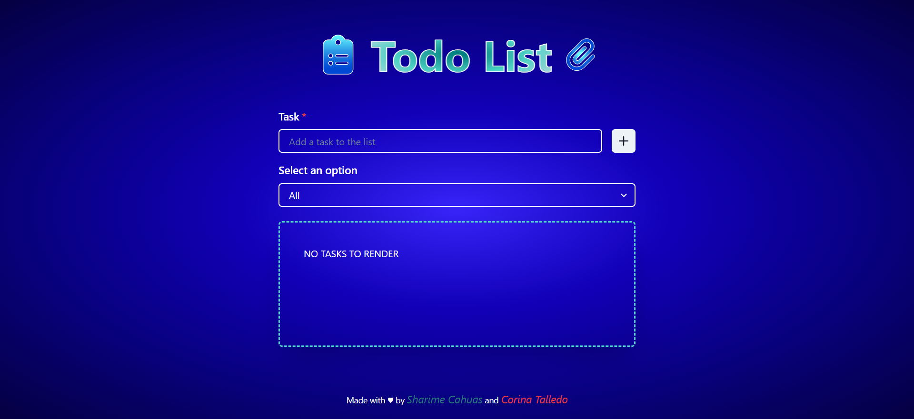

Add task Functionality
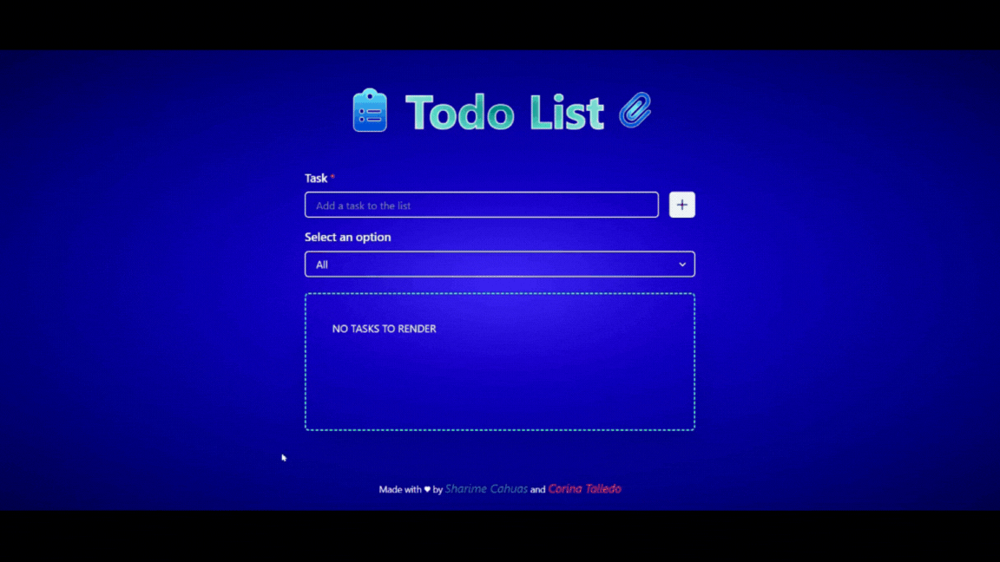

Empty task validation error message
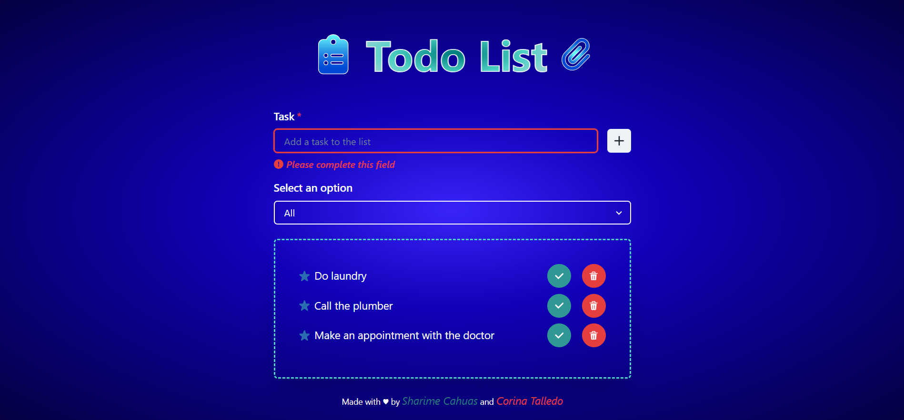
Repeated task validation error message
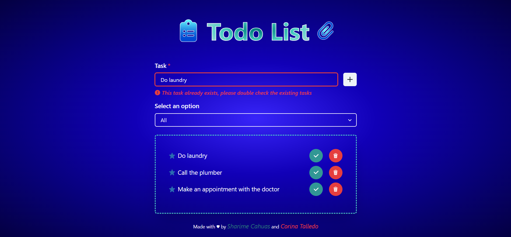

Completed task toggle Functionality
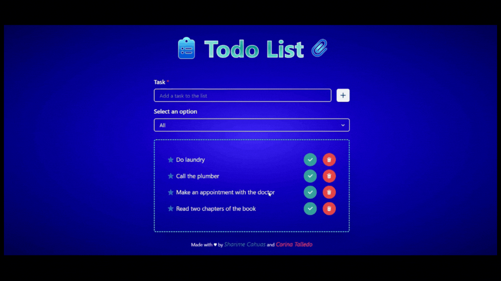
Select filter criteria
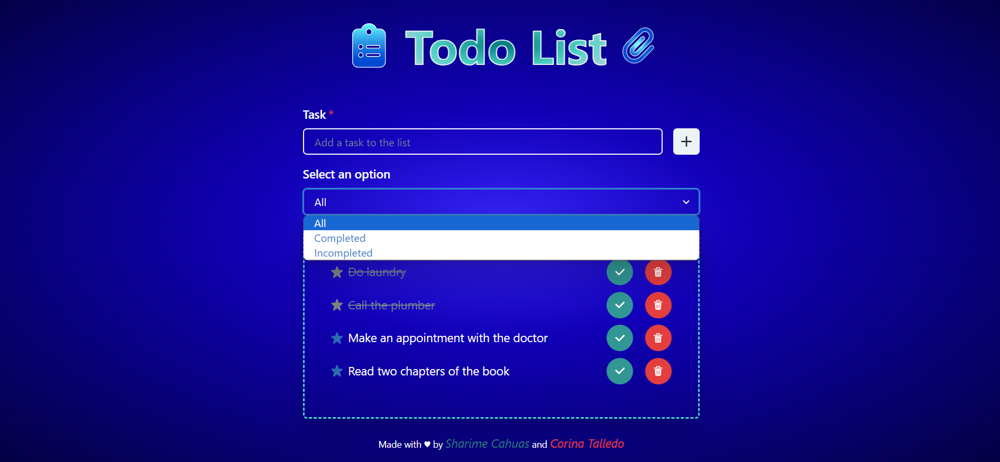
Completed tasks filtered
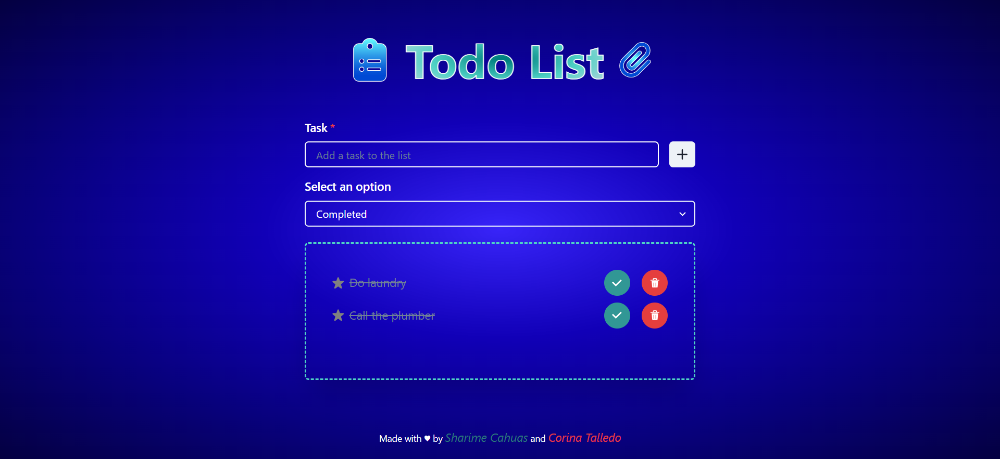
Incompleted tasks filtered
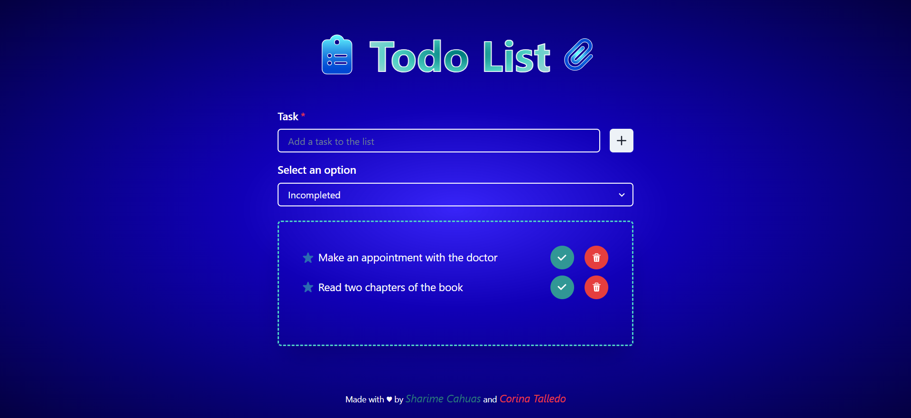

Delete task Functionality
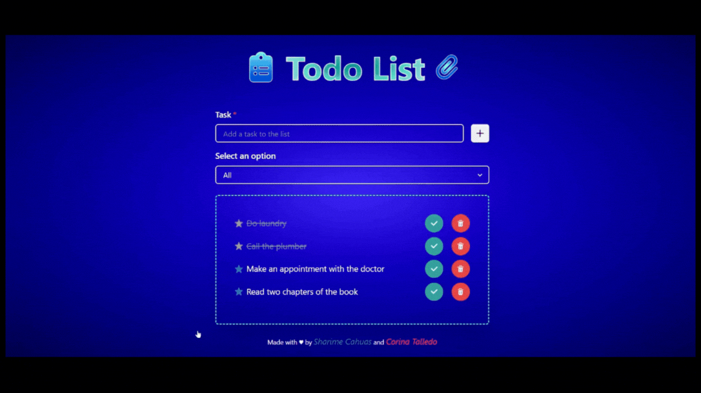

### *Mobile* - Initial window
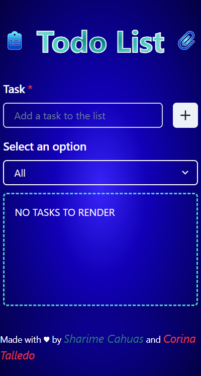

Empty task validation error message

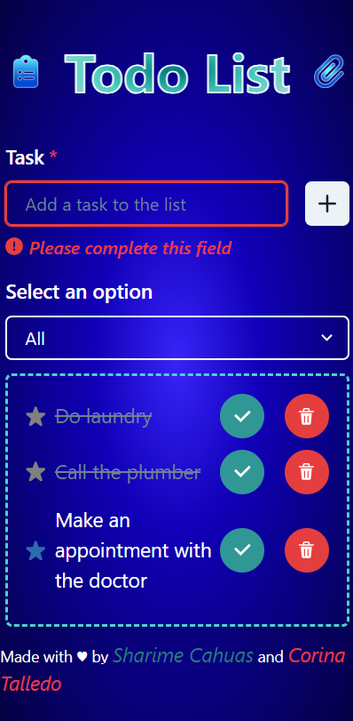   
Repeated task validation error message

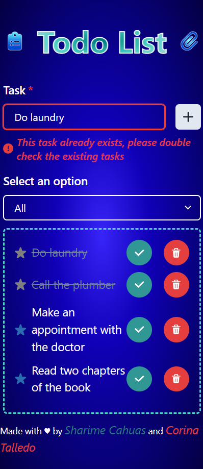

Select filter criteria

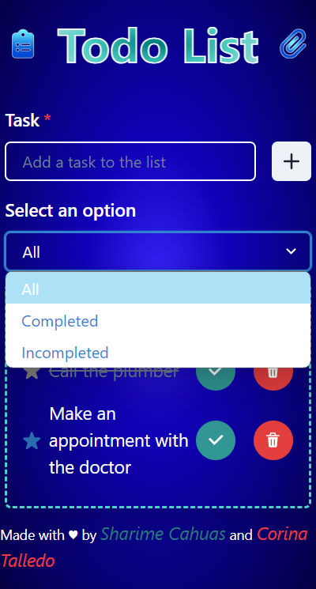  
All tasks filtered

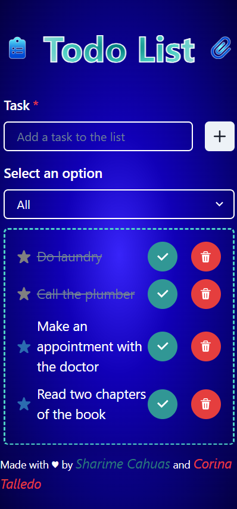  
Completed tasks filtered

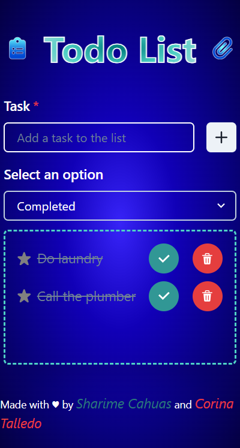  
Incompleted tasks filtered

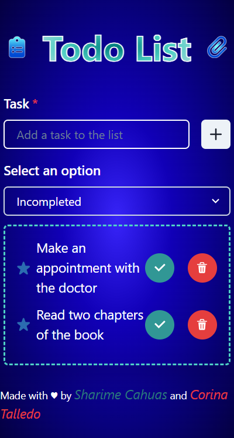

*Tasks Functionalities in Mobile are not shown again, due to lack of substantial differences with Desktop views* 
- Add
- Complete Toggle
- Delete

### 🤝🏻 THANKS FOR THE PACIENCE AND DEDICATION OF OUR TEACHERS:
**ANGEL GUILLERMO MONTAÑA** AND **SOFIA FERRER** 
DURING THE COURSE OF THE 5TH MODULE

### THANKS FOR YOUR VISIT
